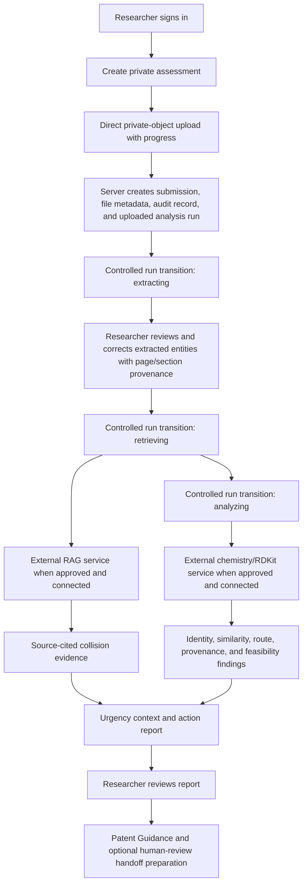
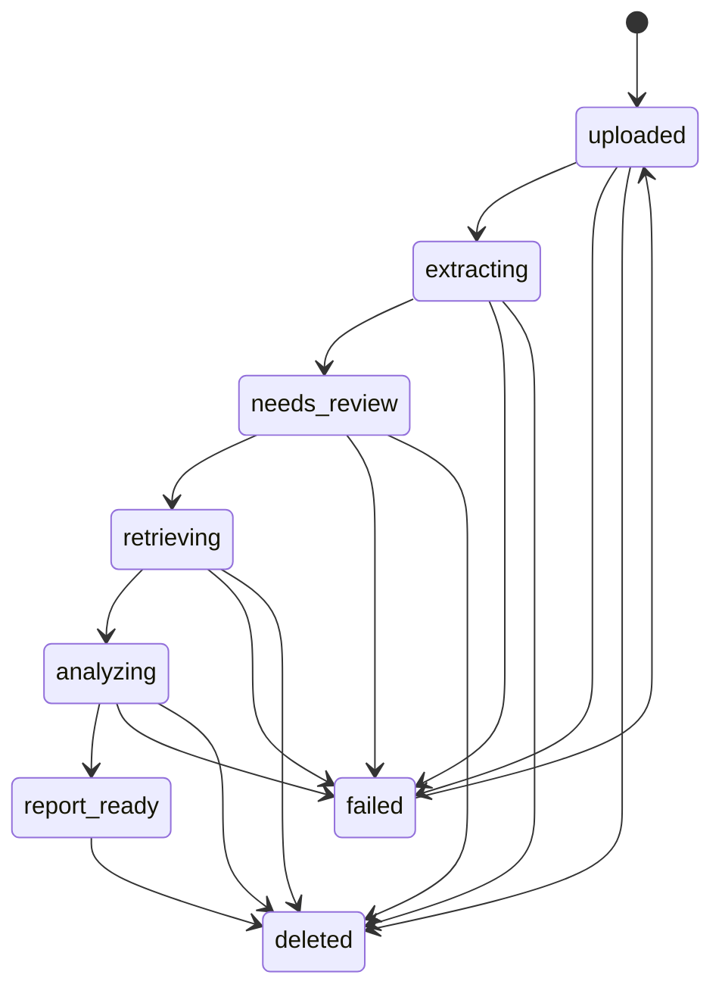
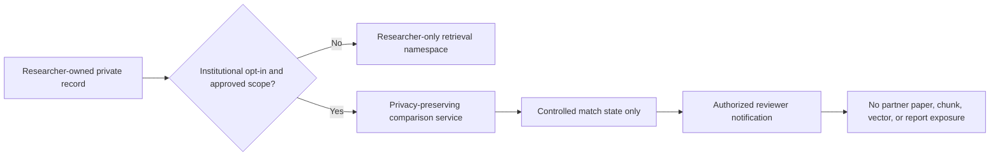

# Sanjeevani System Workflow

## 1. End-to-end researcher flow

## 2. Analysis state machine

The web app owns state transitions and presentation. An intelligence worker may supply evidence and chemistry results, but it cannot bypass the research owner’s review and confirmation workflow.

## 3. RAG and chemistry boundary

| Step | Web app responsibility | External intelligence-service responsibility |
|---|---|---|
| Chunk preparation | Store page-aware records, owner ID, scope, and embedding version | Embed and index chunks in an isolated tenant namespace |
| Retrieval | Issue a server-side request with reviewed source IDs and filters | Run hybrid metadata/vector retrieval and return cited collision evidence |
| Chemistry | Supply confirmed chemistry/route entities only | Normalize inputs, run approved molecular/route tools, and return structured findings |
| Results | Persist versioned results and show disclaimers | Never infer legal, clinical, safety, or manufacturing conclusions |

## 4. Privacy and institutional workflow

Exact matching and similarity/substructure matching have different technical and privacy properties. The product must not call either zero-knowledge unless a reviewed implementation actually supports that claim.

## 5. Guidance assistant workflow

The assistant receives permission-scoped workspace metadata and may invoke only its read-only tools. It responds in **Explain** or **Guide** mode and returns citations when evidence is available. It never has a create, update, delete, share, or filing tool. Any user action that could change data, share a dossier, contact an expert, or initiate a filing remains a separate UI action with an explicit confirmation gate.
